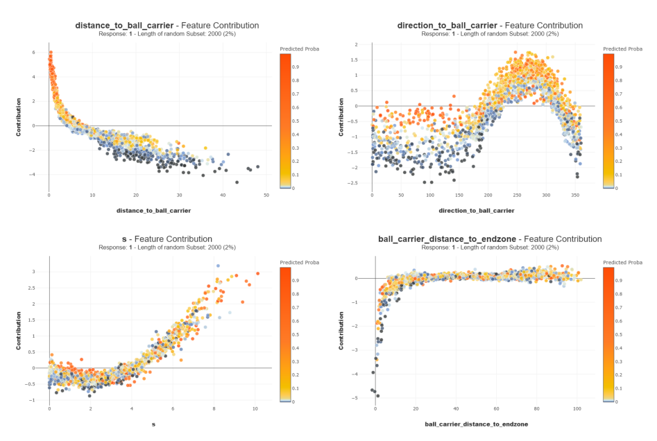

# ExpectedTackling

## MOTT: Missed Opportunities To Tackle
### Introduction
The ability to detect missed opportunities in tackling the ball carrier emerges as a critical aspect to work on for the 2024 NFL Big Data Bowl. Traditional statistics often fall short in capturing the nuances of a player's defensive impact, leaving a void in the comprehensive evaluation of a team's defensive performance. The MOTT Metric aims to fill this void by providing a nuanced and insightful perspective on a player's effectiveness in stopping the ball carrier. This metric goes beyond the basic tally of tackles made and missed, delving into the contextual intricacies of each play. By incorporating factors such as player positioning, probability to tackle, and tackling contribution, the MOTT Metric provides a more accurate reflection of a defender's impact on each play. It unveils the instances where a player had a genuine opportunity to make a crucial stop but fell short, shedding light on areas for technique improvement and tactical refinement. In addition to identifying the missed tackles, this metric aims to detect, for example, instances where a defensive player lacks aggression toward the ball carrier or follows a misjudged closing route, resulting in missed opportunities to tackle.

### A Frame-by-Frame Tackling Probability to Detect the Opportunities
To pinpoint instances of missed opportunities to tackle, the initial step involves detecting the tackling opportunities. This identification is achieved through the meticulous creation of a frame-by-frame probability of tackling for each defensive player. The foundation of this probability model is solely based on the positioning and movements of the defensive player, the ball carrier and the blockers. Thus the frame-by-frame features computed for the model are:
- For the defensive player: tracking data (s, a, dis, o, dir), distances and directions to the ball carrier and the three nearest blockers
- For the ball carrier: tracking data (s, a, dis, o, dir), distances to the nearest sideline and to the endzone
- For the three nearest blockers: tracking data (s, a, dis, o, dir)

Orientation and direction features, initially correlated with the play's direction, undergo adjustments to ensure independence from it.

The probability model operates as a binary classification model, where the objective for each defensive player at every frame is to predict whether they will execute a tackle or provide an assist on the ball carrier. The predicted probability computed by the model corresponds to the desired probability of tackling.

 It is anticipated and intended that the model predicts false positives for players during frames where they are in close proximity to stopping the ball carrier. Likewise, false negatives are expected during the initial frames for players who will make a stop at the conclusion of the play. The data exhibits imbalance, given that in a single play, it is probable that none, or only one or two players among the eleven defensive players aligned, will execute a tackle or provide assistance. This aligns perfectly with the intended model, as the mean predicted probability for such data tends to be relatively low. Moreover, specific features play a crucial role in boosting this probability for tackling opportunities.

The model is configured to predict an equivalent proportion of false negatives and false positives and the results are: 

The analysis of Shapley values, aiming to assess the contributions of each variable, reveals that the model identifies consistent contributions exhibiting clear trends based on the variable modalities. Here are a few examples of features contributions:

- The shorter the distance from the defensive player is to the ball carrier, the higher the probability to tackle or assist
- When the ball carrier is situated in the opposite direction from the endzone he aims to score in, relative to the defensive player, it increases the probability of making a tackle or an assist
- A high speed of the defensive player correlates with a higher probability of tackling or providing assistance
- A very short distance from the ball carrier to the endzone reduces the probability to tackle or assist

The tackling probability generated by the model is visualized in the example play below:

It is conceivable that a defensive player may have multiple opportunities to tackle the ball carrier within the same play. Therefore, it is crucial to identify the various opportunities that the defensive player may have during the play. Based on the tackling probability, a new metric is introduced to measure the frame-by-frame opportunity to tackle, the **OTT**. This metric aims to facilitate the detection of tackling opportunities on a play for each defensive player.
$$OTT = \frac{Tackling\ probability}{Distance\ to\ ball\ carrier} \in [0, +\infty[$$

For each play and defensive player, the OTT metric throughout the frames operates as a signal. It deals with the instability of the frame-by-frame predicted tackling probability and enhances the prominence of the peaks. This simplifies the identification of tackling opportunities thanks to these OTT peaks.

Optimizing the detection of peaks involves conducting a grid search across multiple hyperparameter configurations to pinpoint genuine tackling opportunities. The resulting optimized peak detection yields the following outcomes in this example case of a player having multiple opportunities to tackle within the same play:

Should no tackling opportunities be identified through this peak detection, the argmax of the OTT marks the frame of the play as the optimal opportunity for the defensive player. This enables the retrieval of smaller yet still significant tackling opportunities to study. Furthermore, it becomes possible to predict the outcome of the best opportunity or opportunities for every defensive player on each play.

### Introducing a New Metric for Missed Opportunities To Tackle
With the optimal tackling opportunities identified for every defensive player on each play, the innovative **MOTT** metric aims to reveal the ones that are not only missed tackles but, to a larger extent, missed opportunities to tackle. The creation of MOTT relies solely on four features for every opportunity:
- The OTT value at the frame of the opportunity
- The average distance between the defensive player and the ball carrier, calculated from the frame of the opportunity to the conclusion of the play
- The distance won by the ball carrier from the frame of the opportunity to the end of the play
- Whether or not the defensive player executes a tackle or provides assistance from the opportunity

The target of the model uses the PFF (Pro Football Focus) scouted and provided metric "pff_missedTackle". It indicates whether or not the defensive player missed a tackle on the play. The target is then a transformation of the PFF metric that denotes whether or not the defensive player missed a tackle for every opportunity. The appropriate model is thus a binary classification model. The objective is to minimize false negatives as much as possible. However, given the broader focus on missed tackling opportunities, false positives are also minimized although it is anticipated and intended that some may still be present. They correspond to the missed opportunities that are not missed tackles. Because the chosen feature engineering involves that there is at least one opportunity for every defensive player in each play, the data exhibits a significant imbalance. Thus the model is trained on a sample that reduces the imbalance:

The model achieves great performances. By predicting on the entire dataset, the volume of false positives is higher and corresponds to the missed opportunities that are not missed tackles. The true positives are the well predicted missed tackles.
